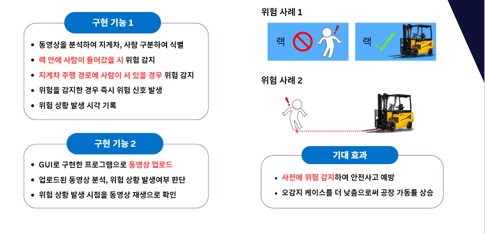

KDT 5기 혜모팀의 기업 프로젝트입니다.

# 엠엔비젼(MNVISION) : 작업자 안전관리 솔루션

## 소개

제조산업 안전에 대한 법령 강화와 중대 재해에 대한 엄격한 처벌 시행에 따라, 작업 공간 내에서의 안전사고 발생을 최소화하기 위한 노력이 진행되고 있습니다.

따라서, 현대자동차 울산공장 내에 설치된 CCTV 영상 데이터를 사용하여 내부 안전사고의 원인과 패턴을 파악하고 예방하기 위한 프로젝트를 수행하였습니다.

### 개발환경

- 운영체제 : Windows 11
- 개발환경 : Visual Studio Code
- 프레임워크 : PyTorch, Flask

## Stack

### 협력 업체

- 엠엔비젼(MNVISION) : [링크](http://mnvision.co.kr/)

### 구성원

임소영(PM) : [Github](https://github.com/YimSoYoung1001)  
명노아 : [Github](https://github.com/noah2397)  
변주영 : [Github](https://github.com/rileybyun)  
손예림 : [Github](https://github.com/osllzd)  
이화은 : [Github](https://github.com/Skylee0310)

## 일정

| 날짜       | 내용                                 | 링크                                                                                                                                        |
| ---------- | ------------------------------------ | ------------------------------------------------------------------------------------------------------------------------------------------- |
| 2024.05.01 | 팀 프로젝트 초기 설정                | [링크](https://docs.google.com/document/d/11rDlDIC1FXRp6a_kL96bDIyI4A_ODqwx/edit?usp=sharing&ouid=110067098172194561192&rtpof=true&sd=true) |
| 2024.05.02 | 프로젝트 관련 시각화 자료 조사       | [링크](https://docs.google.com/document/d/1mukZDHGrvG5kVRodtRGQBNuXZJ940G_x/edit?usp=sharing&ouid=110067098172194561192&rtpof=true&sd=true) |
| 2024.05.07 | 비젼 관련 기술 시장 조사             | [링크](https://docs.google.com/document/d/1RtYCeMjceL8v2CEXiq8HHyaHXghZ9MqC/edit?usp=sharing&ouid=110067098172194561192&rtpof=true&sd=true) |
| 2024.05.08 | 기업 미팅 진행, 요구사항 정의서 작성 | [링크](https://docs.google.com/document/d/1hnzKoSHDoXM1po03oT-R1nz527VQscft/edit?usp=sharing&ouid=110067098172194561192&rtpof=true&sd=true) |
| 2024.05.10 | 프로젝트 계획 발표 & 기타 안건 발의  | [링크](https://docs.google.com/document/d/1myksuGxAPvzxuBnPrAHO1af6OlWAGEtG/edit?usp=sharing&ouid=110067098172194561192&rtpof=true&sd=true) |
| 2024.05.13 |                                      | [링크]()                                                                                                                                    |

### 기술 문서

1. 프로젝트 계획서(PPT) : [링크](https://www.canva.com/design/DAGEsOPGjEs/bs7mmdzugZokbFrcWfyEUA/view?utm_content=DAGEsOPGjEs&utm_campaign=designshare&utm_medium=link&utm_source=editor)
2. 간트 차트 : [링크](https://docs.google.com/spreadsheets/d/1jIBuAatHE040tEuWWt_ELjKuuFLut5WB/edit?usp=sharing&ouid=110067098172194561192&rtpof=true&sd=true)
3. 일일업무보고 : [링크](https://docs.google.com/spreadsheets/d/1Hw6-rosnK7MumOWz8aodKlhbSH0-8ZpC/edit?usp=sharing&ouid=110067098172194561192&rtpof=true&sd=true)
4. 요구사항 정의서 : [링크](https://docs.google.com/spreadsheets/d/1aT5VzIIrWiKlmHyt_mkaFU7nSRwweqj5/edit?usp=sharing&ouid=110067098172194561192&rtpof=true&sd=true)

### Notion

Notion : [링크](https://water-maple-b1a.notion.site/_-_-43f06266c0f84a9ba1832b29022a6afd?pvs=4)
